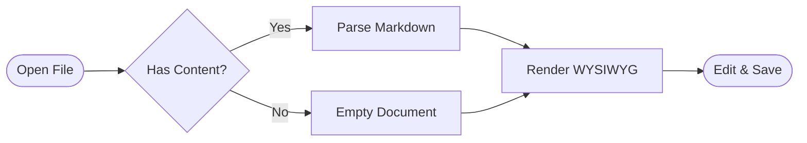
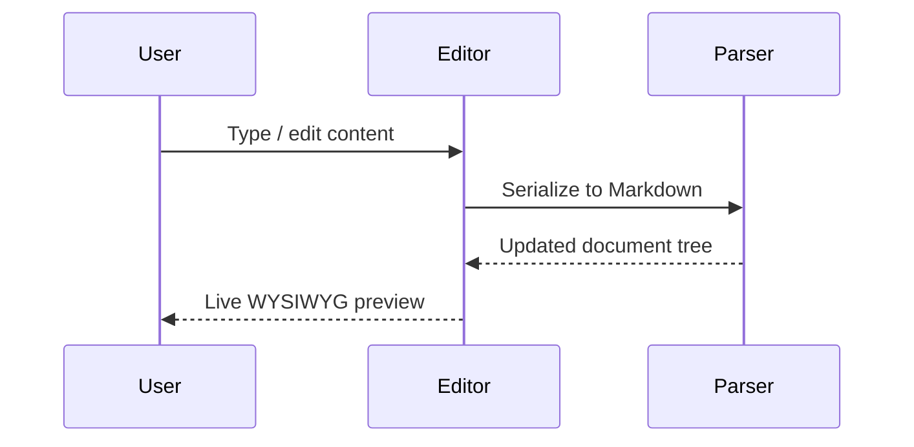

# Welcome to MD Editor

A WYSIWYG Markdown editor with first-class support for Mermaid diagrams, LaTeX math, tables, callouts, and rich inline formatting.

Type `/` on any new line to insert blocks. Press **⌘N** to start a new document.

> \[!INFO]
>
> This is a **Sample Document** — read-only and never saved to disk. Open a new file with **⌘N** or **File → New** to start writing your own content.

---

## Text Formatting

Standard Markdown plus extensions:

- **Bold**, *italic*, ~~strikethrough~~, `inline code`, <u>underline</u>
- ==Highlight==, x^2^ superscript, H~2~O subscript
- [Hyperlinks](https://example.com) inline

Right-click selected text for a formatting menu, or use the floating toolbar that appears on selection.

---

## Headings

All six heading levels are available via the `/` slash command or standard `#` Markdown syntax.

### H3 — Section heading
#### H4 — Sub-section
##### H5 — Minor heading
###### H6 — Smallest heading

---

## Tables

Tables support per-column horizontal alignment (`| :--- |`, `| :---: |`, `| ---: |`) via the bubble toolbar or right-click menu.

| Feature | Shortcut | Notes |
| :--- | :---: | ---: |
| Bold | ⌘B | |
| Italic | ⌘I | |
| Find | ⌘F | |
| Replace | ⌘H | |
| Source view | ⌘/ | Raw Markdown |
| New tab | ⌘N | |
| Open file | ⌘O | |
| Save | ⌘S | |

---

## Callouts

> \[!INFO]
>
> Use callouts to surface important information. Insert with `/callout`.

> \[!WARNING]
>
> Warn readers about potential pitfalls or breaking changes.

> \[!SUCCESS]
>
> Confirm that a step completed successfully.

> \[!DANGER]
>
> Alert readers to critical or destructive actions.

---

## Task Lists

- [x] WYSIWYG editing with live Markdown sync
- [x] Mermaid diagram rendering
- [x] LaTeX / KaTeX math rendering
- [x] Table alignment controls
- [x] Highlight, superscript, subscript
- [x] Find & Replace
- [ ] Build something great

---

## Mermaid Diagrams

Click **outside** the block to render the diagram. Click **on the preview** to edit the source.





---

## LaTeX Math

Inline math flows with text: the quadratic formula $x = \frac{-b \pm \sqrt{b^2 - 4ac}}{2a}$ finds the roots of $ax^2 + bx + c = 0$.

Block math — click outside to render, click inside to edit the source:

$$
\int_0^\infty e^{-x^2}\,dx = \frac{\sqrt{\pi}}{2}
$$

$$
\begin{align}
E &= mc^2 \\
F &= ma \\
\nabla \cdot \mathbf{E} &= \frac{\rho}{\varepsilon_0}
\end{align}
$$

---

## Code Blocks

Fenced code blocks with language tags are supported. Insert with `/code` or triple backtick.

```typescript
interface Document {
  id: string;
  title: string;
  markdown: string;
  updatedAt: number;
}

function parseDocument(raw: string): Document {
  const titleMatch = raw.match(/^#\s+(.+)/m);
  return {
    id: crypto.randomUUID(),
    title: titleMatch?.[1] ?? "Untitled",
    markdown: raw,
    updatedAt: Date.now(),
  };
}
```

```python
def word_count(text: str) -> int:
    return len(text.split())
```

---

## Requirement Example

Headings can encode requirement IDs — useful for specification documents.

### REQ_001 \[Draft]

The system shall authenticate users via OAuth 2.0 before granting access to protected resources.

### REQ_002 \[Approved]

All API responses shall include a `Content-Security-Policy` header.

---

*Open **⌘N** to create a new document, or **⌘O** to open an existing Markdown file.*
